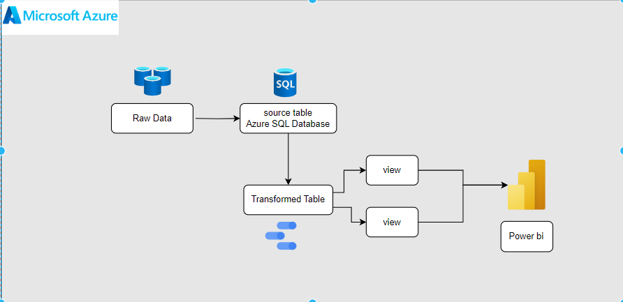
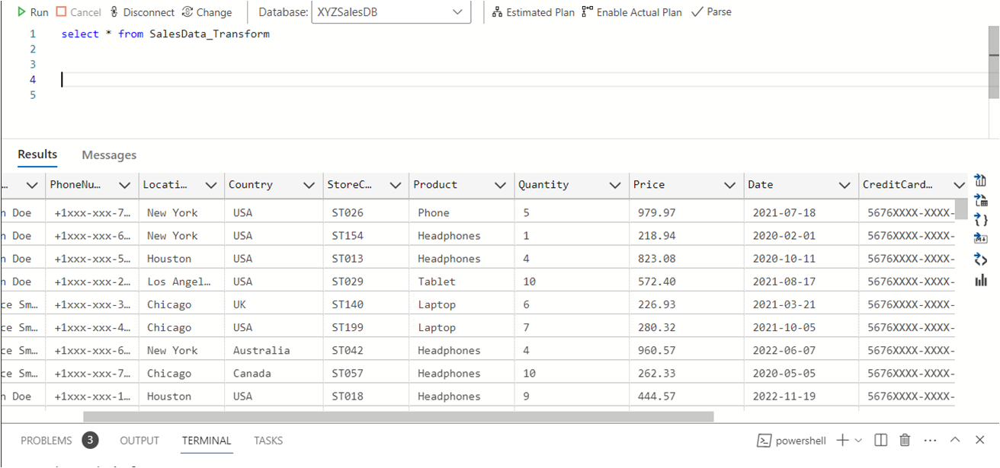
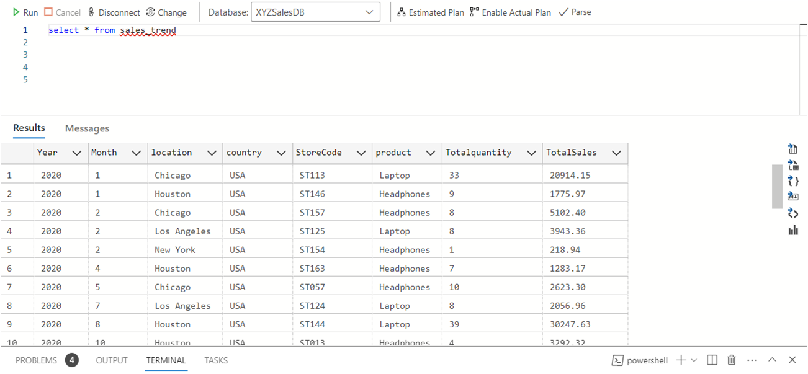
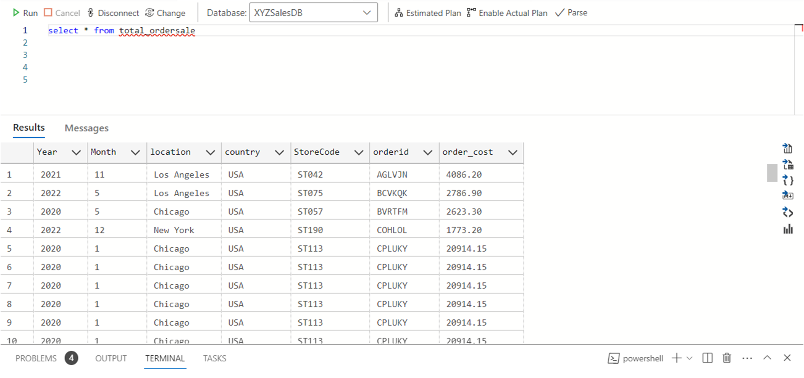
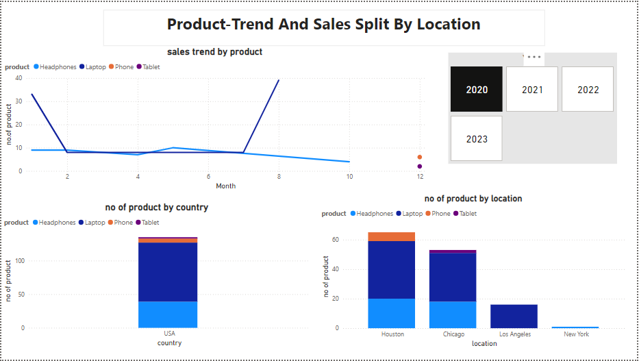
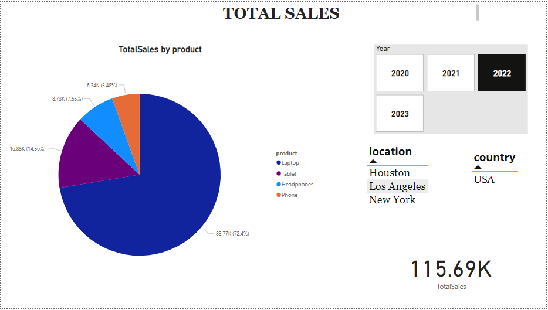
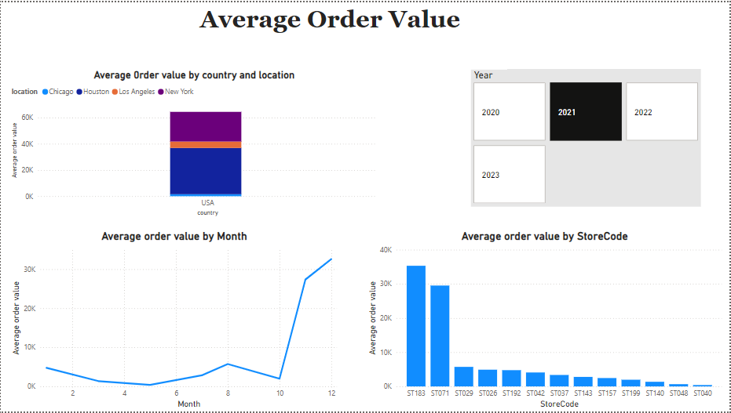
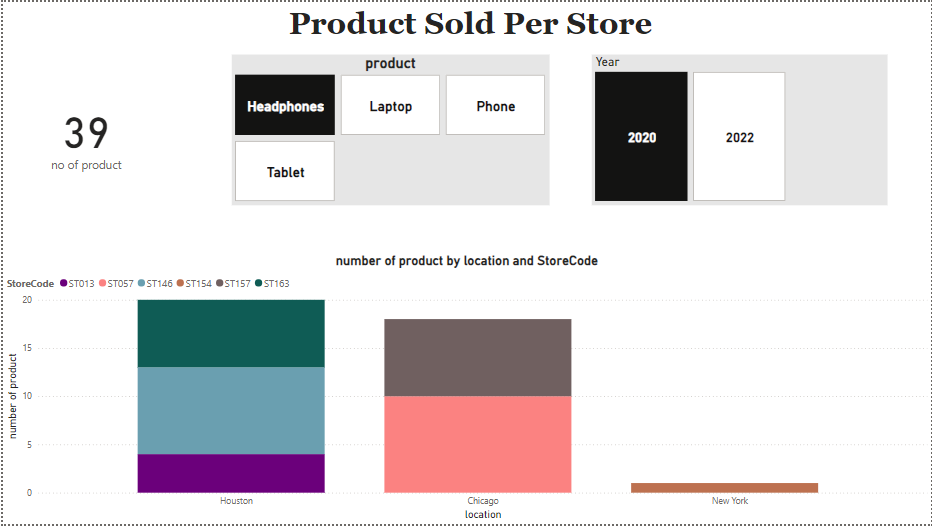

# Azure-data-engg-project
Azure Data engg project using Azure SQL Database and Azure Data Studio
## Introduction
Ingest sales data from a CSV file into Azure SQL Database. Ensure data quality and handle data anomalies. Transform the raw sales data to create meaningful insights.masked Personally identifiable informations.
## Architecture Diagram

## Technology Used
1. SQL
2. AZURE
    - Azure Sql Database
    - Azure Data studio
3. Power bi
## DataSet used - https://github.com/adhilahmd/Azure-data-engg-project/blob/main/raw%20data.csv
## Script used - https://github.com/adhilahmd/Azure-data-engg-project/blob/main/code.txt
## DataSet Documentation 
- The quantity column In source tabe contains values which is of type float and the decimal value for quantity doesn’t look sense.
- Changed the data type of quantity to int to remove the decimal values.
- The country column and location column also doesn’t look sense as some of the data in location doesn’t matches the exact country were the location belongs.for example The location column contains ‘new york’ and the corresponding country column contains ‘canada’ which is not correct.
- Hence created a column named corrected country.
- In the transformation code ,perfome masking of PII
- Masked phone number first 6 digits excluding country code and shown last 4 digits.
- Masked middle 8 digits of creditcard numbers showing first and last 4 digits.
- By creating the stored procedure when we inserted the csv file to source table using ‘import wizard’ option in azure data studio , we have to execute the stored procedure by ‘exec’ query and the data in source table is transferred to the transform table with all the above transformation and processing jobs done.
- We can also fully automate the stored procedure without inputting execute query by setting up a SQL server agent job by installing  SQL server agent extension in azure data studio.
## Transformed Table 

## view Tables

## Power bi

 
- Here we can see the total sales of the year 2022.
- The total sales happened in 2022 is 115.69k.
- We can also visualize total sales by each product.
- We can filter out the total sales by each year and each location
  

- The average order value can be visualized from here.
- We can filter out by each year and see the average order value trend.
- Here we can see the average order value by each country and location,average order value trend of each month and average order value by storecode in the year 2021
- We can visualize that the storecode ‘ST183’ has the highest average order value  and the location is houston in year 2021

